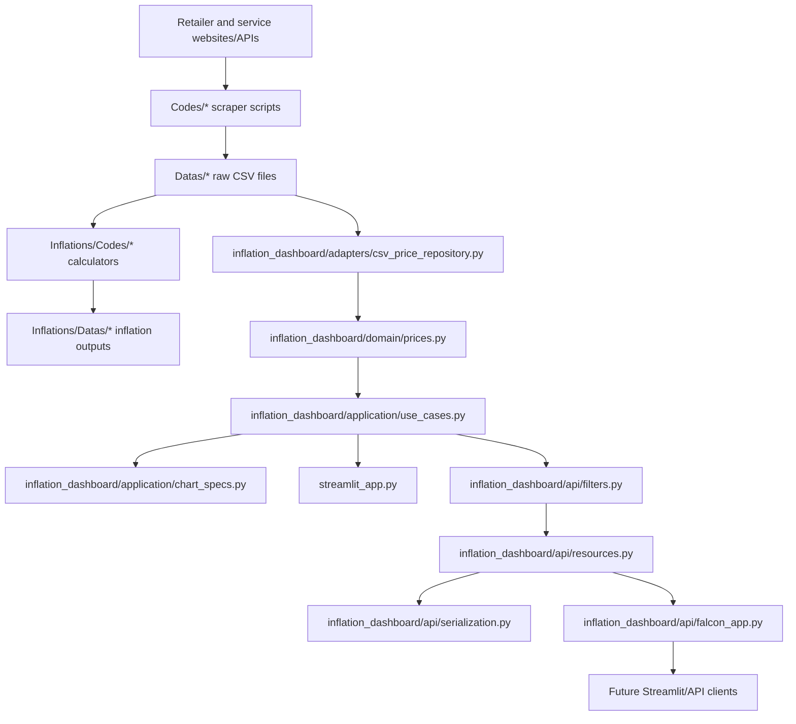

<!-- generated-by: gsd-doc-writer -->
# Architecture

## System Overview

Inflation Study Mirror is a Python repository for collecting Turkish retailer and service price data, storing the results as CSV files, calculating inflation-oriented outputs, and exploring scraped prices through a dashboard stack.

The current application architecture has two generations that coexist:

1. **Legacy collection and inflation scripts**: standalone scraper scripts under `Codes/`, raw CSV data under `Datas/`, calculator scripts under `Inflations/Codes/`, and calculated outputs under `Inflations/Datas/`.
2. **Phase 1/Phase 2 dashboard architecture**: a framework-independent `inflation_dashboard/` package that separates CSV access, domain normalization, application use cases, chart/table contracts, and a Falcon API backend. The existing `streamlit_app.py` still reads the shared package directly; Phase 3 is planned to move Streamlit data access to the Falcon API.

## Component Diagram



## Runtime Entry Points

| Entry point | Role | Notes |
|---|---|---|
| `streamlit_app.py` | Current dashboard UI | Uses Streamlit and Plotly, caches CSV inventory/history with `st.cache_data`, and calls the shared adapter/use-case/chart-spec modules directly. |
| `inflation_dashboard.api.falcon_app.create_app()` | Falcon WSGI app factory | Registers API resources for health, inventory, history, retailer averages, movers, and coverage. |
| `scripts/verify_falcon_api.py` | Phase 2 API verification | Uses Falcon's in-process `TestClient`; it does not bind ports or start a persistent server. |
| `Codes/.../*.py` | Scrapers | Source-specific scripts that collect raw CSV data into `Datas/`. |
| `Inflations/Codes/.../*.py` | Inflation calculators | Source-specific scripts/configuration that produce processed inflation outputs under `Inflations/Datas/`. |

## Data Flow

1. Source-specific scraper scripts fetch product, rental, construction, cosmetics, clothing, market, home goods, health, or technology price data.
2. Scrapers write date-bearing CSV files into `Datas/` subdirectories such as `Datas/Markets/Gurmar/` and `Datas/ClothingStores/Vakko/`.
3. Inflation calculators read source CSVs, normalize prices/categories for their category, and write detailed or summary outputs into `Inflations/Datas/`.
4. The dashboard/API path reads raw `Datas/` CSV files through `inflation_dashboard.adapters.csv_price_repository.discover_csv_inventory()` and `load_price_history()`.
5. `inflation_dashboard.domain.prices` extracts dates from filenames, coerces price values, detects product identifiers/names/categories, and normalizes rows into the shared history shape.
6. `inflation_dashboard.application.use_cases` computes inventory filters, product history slices, product summaries, retailer average trends, price movers, coverage summaries, coverage over time, and category coverage.
7. The current Streamlit UI renders the use-case outputs directly with Plotly and Streamlit widgets.
8. The Falcon API exposes the same shared use cases as JSON envelopes for the planned Streamlit API frontend.

## Phase 2 Falcon API Backend

Phase 2 added the `inflation_dashboard/api/` boundary around the Phase 1 core. The API layer is intentionally thin: it parses HTTP query parameters, loads bounded CSV history through the adapter, calls application use cases, converts pandas/numpy/date values to JSON-native data, and returns stable response envelopes.

### Registered Routes

`inflation_dashboard.api.falcon_app.create_app()` registers these Falcon resources:

| Route | Resource | Purpose |
|---|---|---|
| `/api/health` | `HealthResource` | Lightweight status check returning service metadata; it does not load inventory/history data. |
| `/api/inventory` | `InventoryResource` | Lists available retailers plus minimum/maximum dates and file counts from discovered CSV inventory. |
| `/api/history` | `HistoryResource` | Returns filtered normalized price history, or a single product history plus summary when `product_name` is supplied. |
| `/api/retailer-averages` | `RetailerAveragesResource` | Returns average or median price trends grouped by date and retailer. |
| `/api/movers` | `MoversResource` | Returns biggest drops and gains for repeated product observations. |
| `/api/coverage` | `CoverageResource` | Returns dataset summary, coverage over time, category coverage, and skipped-file diagnostics. |

### Common API Filters

`inflation_dashboard.api.filters.parse_common_filters()` supports these query parameters across data endpoints:

| Parameter | Behavior |
|---|---|
| `retailer` | Repeatable retailer filter. Unknown retailers produce a `400 Bad Request` error envelope. If omitted, the API prefers `DEFAULT_RETAILERS` that exist in inventory, otherwise the first available retailers. |
| `start_date` / `end_date` | ISO date filters. Defaults to the latest 60-day window bounded by inventory min/max dates. Start dates after end dates are rejected. |
| `max_files` | Maximum files to load per retailer. Defaults to `DEFAULT_MAX_FILES_PER_RETAILER` (`45`). `0` means uncapped/all history. Negative or non-integer values are rejected. |
| `all_history` | Boolean flag that forces uncapped loading and adds an uncapped-history warning to metadata. |

Endpoint-specific parameters include `product_name` and `product_retailer` for `/api/history`, `aggregation=Average|Median` for `/api/retailer-averages`, `scope_retailer`, `limit`, and `mover_count` for `/api/movers`, and `category_limit` for `/api/coverage`.

### Response Contract

All API resources use `inflation_dashboard.api.serialization.envelope()` or `error_envelope()` and return the same top-level object shape:

```json
{
  "data": {},
  "meta": {},
  "errors": []
}
```

`serialization.py` recursively converts pandas timestamps, numpy scalar values, dates, NaN values, mappings, tuples, and lists into JSON-native values. This keeps Falcon responses safe for future frontend consumption and is verified by `scripts/verify_falcon_api.py`.

## Key Abstractions

| Abstraction | Location | Purpose |
|---|---|---|
| `parse_date_from_name()` | `inflation_dashboard/domain/prices.py` | Extracts dates from CSV filenames that contain a `20xx-MM-DD` or `20xx_MM_DD` pattern. |
| `coerce_price()` | `inflation_dashboard/domain/prices.py` | Normalizes Turkish lira strings, decimal commas, thousands separators, and numeric values to floats. |
| `build_product_frame()` | `inflation_dashboard/domain/prices.py` | Converts source-specific CSV rows into the normalized price-history shape. Includes special handling for house-rent rows and Watson cosmetics rows. |
| `detect_retailer()` | `inflation_dashboard/adapters/csv_price_repository.py` | Derives a retailer label from a CSV path under `Datas/`. |
| `discover_csv_inventory()` | `inflation_dashboard/adapters/csv_price_repository.py` | Builds lightweight inventory rows for supported dated CSV files without loading all row data. |
| `load_price_history()` | `inflation_dashboard/adapters/csv_price_repository.py` | Loads bounded normalized price history for selected retailers, dates, and file caps; returns skipped-file diagnostics separately. |
| `list_inventory_filters()` | `inflation_dashboard/application/use_cases.py` | Produces retailer/date/file-count filter metadata from inventory rows. |
| `get_product_history()` | `inflation_dashboard/application/use_cases.py` | Selects and sorts one product's time series for a retailer. |
| `summarize_product_history()` | `inflation_dashboard/application/use_cases.py` | Computes latest price, cheapest price/date, and change since first observation. |
| `calculate_retailer_average_trends()` | `inflation_dashboard/application/use_cases.py` | Computes mean or median price trends by date and retailer. |
| `calculate_price_movers()` | `inflation_dashboard/application/use_cases.py` | Finds biggest drops and gains for products with repeated observations. |
| `calculate_coverage_summary()` | `inflation_dashboard/application/use_cases.py` | Summarizes retailer, product, observation, date-range, and skipped-file coverage. |
| `calculate_coverage_over_time()` | `inflation_dashboard/application/use_cases.py` | Counts tracked products by date and retailer. |
| `calculate_category_coverage()` | `inflation_dashboard/application/use_cases.py` | Counts tracked products by retailer and category, capped by a caller-supplied limit. |
| `records_from_frame()` | `inflation_dashboard/api/serialization.py` | Converts selected DataFrame columns into ordered JSON-safe records. |
| `parse_common_filters()` | `inflation_dashboard/api/filters.py` | Validates common API query filters and computes selected inventory metadata. |
| `create_app()` | `inflation_dashboard/api/falcon_app.py` | Creates the Falcon app and attaches all API resources. |

## Directory Structure Rationale

```text
Codes/                         Source-specific scraper scripts
Datas/                         Tracked raw scraped CSV data
Inflations/Codes/              Source-specific inflation calculators and config
Inflations/Datas/              Generated inflation details and summaries
inflation_dashboard/domain/    Framework-independent parsing and normalization helpers
inflation_dashboard/adapters/  CSV storage adapter over tracked Datas/ files
inflation_dashboard/application/ Dashboard use cases plus chart/table specs
inflation_dashboard/api/       Falcon resources, filter parsing, and JSON serialization
scripts/                       Focused verification scripts, including Falcon API smoke checks
streamlit_app.py               Current Streamlit dashboard entry point
.github/workflows/             Scheduled scraper automation when workflow files are present
```

The repository remains intentionally file-based. CSVs are the storage boundary, and most scraper/calculator scripts are standalone so they can be run individually or scheduled independently. The `inflation_dashboard/` package adds a cleaner application boundary without changing the existing scraper/data layout.

## Boundaries and Constraints

- `Codes/` owns ingestion from websites and APIs.
- `Datas/` and `Inflations/Datas/` are data stores, not application code.
- `Inflations/Codes/` owns inflation calculations and TUIK-style category weighting logic.
- `inflation_dashboard/domain/`, `inflation_dashboard/adapters/`, and `inflation_dashboard/application/` own reusable dashboard-domain logic and must remain free of Streamlit, Plotly, and Falcon imports.
- `inflation_dashboard/api/` owns Falcon HTTP concerns and JSON response contracts. It must not import Streamlit, Plotly, or `streamlit_app.py`.
- `streamlit_app.py` owns the current UI, Streamlit widget state, caching decorators, and Plotly rendering.
- Phase 3 has not yet landed: Streamlit still scans/loads CSVs through the shared adapter instead of calling the Falcon API over HTTP.
- API history loading is bounded by default (`DEFAULT_MAX_FILES_PER_RETAILER = 45`) to avoid accidentally loading every CSV file; `all_history` and `max_files=0` intentionally opt into uncapped loading.
- Generated CSV data is tracked in git; broad ignore rules for `Datas/`, `Inflations/Datas/`, or `logs/` would change repository behavior.

## Verification

The Falcon backend is verified by `scripts/verify_falcon_api.py`, which checks:

- API and core import boundaries.
- Registered endpoint route strings and stable response keys.
- JSON-native envelope serialization.
- In-process endpoint smoke coverage for health, inventory, history, retailer averages, movers, coverage, product-history empty state, and invalid-filter handling.

The Phase 2 verification artifact at `.planning/phases/02-falcon-api-backend/02-VERIFICATION.md` records the API backend as passed after `uv run python scripts/verify_falcon_api.py` exited successfully.
