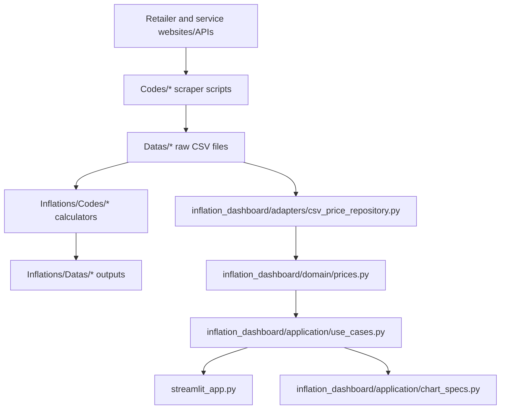

<!-- generated-by: gsd-doc-writer -->
# Architecture

## System Overview

Inflation Study Mirror is a Python data collection and analysis repository for Turkish retailer and service prices. Scrapers under `Codes/` collect raw CSV data into `Datas/`, calculator scripts under `Inflations/Codes/` produce inflation-oriented outputs under `Inflations/Datas/`, and `streamlit_app.py` provides an interactive dashboard over tracked CSV data. A newer `inflation_dashboard/` package contains framework-independent dashboard parsing, loading, and aggregation logic that is shared by the dashboard and future service adapters.

## Component Diagram



## Data Flow

1. Source-specific scraper scripts fetch product, rental, construction, cosmetics, clothing, market, home goods, health, or technology price data.
2. Scrapers write date-bearing CSV files into `Datas/` subdirectories such as `Datas/Markets/Gurmar/` and `Datas/ClothingStores/Vakko/`.
3. Inflation calculators read source CSVs, normalize prices/categories, compare dates, and write detailed and summary outputs into `Inflations/Datas/`.
4. The dashboard path reads raw `Datas/` CSV files through `inflation_dashboard.adapters.csv_price_repository.discover_csv_inventory()` and `load_price_history()`.
5. Application use cases compute inventory filters, product history slices, retailer averages, price movers, coverage summaries, coverage over time, and category coverage.
6. `streamlit_app.py` renders filters, charts, tables, and search/autocorrection UI for the current dashboard.

## Key Abstractions

| Abstraction | Location | Purpose |
|---|---|---|
| `parse_date_from_name()` | `inflation_dashboard/domain/prices.py` | Extracts dates from CSV filenames using the repository's date pattern. |
| `coerce_price()` | `inflation_dashboard/domain/prices.py` | Normalizes Turkish lira strings, decimal commas, and numeric values to floats. |
| `build_product_frame()` | `inflation_dashboard/domain/prices.py` | Converts source-specific CSV rows into the normalized price-history shape. |
| `discover_csv_inventory()` | `inflation_dashboard/adapters/csv_price_repository.py` | Builds a lightweight inventory of supported CSV files without loading all row data. |
| `load_price_history()` | `inflation_dashboard/adapters/csv_price_repository.py` | Loads bounded price history for selected retailers, dates, and file caps. |
| `list_inventory_filters()` | `inflation_dashboard/application/use_cases.py` | Produces retailer/date/file-count filter metadata from inventory rows. |
| `get_product_history()` | `inflation_dashboard/application/use_cases.py` | Selects a single product's time series for a retailer. |
| `summarize_product_history()` | `inflation_dashboard/application/use_cases.py` | Computes latest price, cheapest price/date, and change since first observation. |
| `calculate_retailer_average_trends()` | `inflation_dashboard/application/use_cases.py` | Computes mean or median price trends by date and retailer. |
| `calculate_price_movers()` | `inflation_dashboard/application/use_cases.py` | Finds biggest drops and gains from filtered history. |
| `calculate_coverage_summary()` | `inflation_dashboard/application/use_cases.py` | Summarizes retailer, product, observation, date-range, and skipped-file coverage. |

## Directory Structure Rationale

```text
Codes/                         Source-specific scraper scripts
Datas/                         Tracked raw scraped CSV data
Inflations/Codes/              Source-specific inflation calculators and config
Inflations/Datas/              Generated inflation details and summaries
inflation_dashboard/domain/    Framework-independent parsing and normalization helpers
inflation_dashboard/adapters/  CSV storage adapter over tracked Datas/ files
inflation_dashboard/application/ Dashboard use cases and chart/table specs
streamlit_app.py               Current Streamlit dashboard entrypoint
.github/workflows/             Scheduled scraper automation that commits generated CSVs
```

The repository is intentionally file-based. CSVs are the storage boundary, and most scraper/calculator scripts are standalone so they can be run individually or scheduled independently. The `inflation_dashboard/` package provides a cleaner boundary for dashboard data access without changing the existing scraper layout.

## Boundaries and Constraints

- `Codes/` owns ingestion from websites and APIs.
- `Datas/` and `Inflations/Datas/` are data stores, not application code.
- `Inflations/Codes/` owns inflation calculations and TUIK-style category weighting logic.
- `inflation_dashboard/` owns reusable dashboard-domain logic and must remain free of Streamlit-specific rendering concerns.
- `streamlit_app.py` owns the current UI and Plotly rendering.
- Generated CSV data is tracked in git; broad ignore rules for `Datas/`, `Inflations/Datas/`, or `logs/` would change repository behavior.
