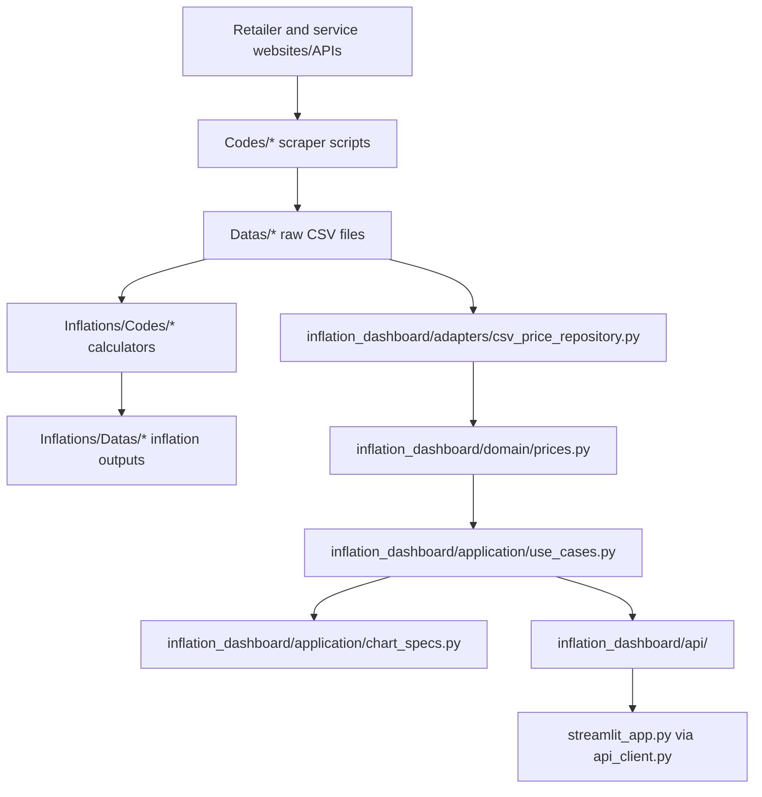

<!-- generated-by: gsd-doc-writer -->
# Architecture

## System Overview

Inflation Study Mirror is a Python repository for collecting Turkish retailer and service price data, storing the results as CSV files, calculating inflation-oriented outputs, and exploring scraped prices through a dashboard stack.

The application architecture has two generations that coexist:

1. **Legacy collection and inflation scripts**: standalone scraper scripts under `Codes/`, raw CSV data under `Datas/`, calculator scripts under `Inflations/Codes/`, and calculated outputs under `Inflations/Datas/`.
2. **Three-phase dashboard architecture**: a framework-independent `inflation_dashboard/` package that separates CSV access, domain normalization, application use cases, chart/table contracts, a Falcon API backend, and a Streamlit frontend that consumes the API over HTTP. All three phases are complete:
   - **Phase 1 (Hexagonal Core Extraction)**: Extracted data parsing, loading, and use cases from `streamlit_app.py` into framework-independent modules under `inflation_dashboard/domain/`, `inflation_dashboard/adapters/`, and `inflation_dashboard/application/`.
   - **Phase 2 (Falcon API Backend)**: Added Falcon HTTP resources, filter parsing, and JSON serialization under `inflation_dashboard/api/`.
   - **Phase 3 (Streamlit API Frontend)**: Refactored `streamlit_app.py` to read all dashboard data through the Falcon API via `inflation_dashboard/frontend/api_client.py` instead of direct CSV scans.

## Component Diagram



## Runtime Entry Points

| Entry point | Role | Notes |
|---|---|---|
| `streamlit_app.py` | Dashboard frontend UI | Uses Streamlit and Plotly. Reads all dashboard data via `inflation_dashboard.frontend.api_client` over HTTP to the Falcon API. |
| `inflation_dashboard.api.falcon_app.create_app()` | Falcon WSGI app factory | Registers API resources for health, inventory, history, retailer averages, movers, and coverage. Serves as the sole data backend for the Streamlit frontend. |
| `scripts/verify_falcon_api.py` | Falcon API verification | Uses Falcon's in-process `TestClient`; does not bind ports or start a persistent server. |
| `scripts/verify_streamlit_api_frontend.py` | Frontend API client verification | Source-scans and behavior-checks the frontend API client and Streamlit tab wiring. |
| `scripts/verify_full_stack.py` | Combined full-stack smoke test | Exercises API endpoints through TestClient AND the frontend API client through the same test server. |
| `Codes/.../*.py` | Scrapers | Source-specific scripts that collect raw CSV data into `Datas/`. |
| `Inflations/Codes/.../*.py` | Inflation calculators | Source-specific scripts that produce processed inflation outputs under `Inflations/Datas/`. |

## Data Flow

1. Source-specific scraper scripts fetch product data from websites/APIs.
2. Scrapers write date-bearing CSV files into `Datas/` subdirectories.
3. Inflation calculators read source CSVs and write outputs into `Inflations/Datas/`.
4. The dashboard/API path reads raw `Datas/` CSV files through `inflation_dashboard.adapters.csv_price_repository`.
5. Domain logic normalizes prices, detects products, and transforms rows into a shared history shape.
6. Application use cases compute inventory filters, product history slices, summaries, retailer averages, price movers, and coverage.
7. The Falcon API (`inflation_dashboard/api/`) exposes the same shared use cases as JSON envelopes over HTTP.
8. **API-side TTL cache**: `inflation_dashboard/api/filters.py` caches the CSV inventory (60s TTL) and loaded price history (45s TTL, keyed by filter parameters). When the Streamlit frontend renders all four tabs simultaneously, each calls a different API endpoint, but the first to load CSV data populates the cache — subsequent endpoints reuse the same data instead of re-reading CSVs from disk. Hot requests are served in ~5ms instead of ~280ms.
9. The Streamlit frontend (`streamlit_app.py`) calls the Falcon API through `inflation_dashboard/frontend/api_client.py` and renders the responses using Plotly charts and Streamlit widgets.

## Running the Stack

The Falcon API and Streamlit frontend run as separate processes:

```bash
# Terminal 1: Start the Falcon API server
uv run waitress-serve --port=8000 inflation_dashboard.api.falcon_app:create_app

# Terminal 2: Start the Streamlit frontend (reads from Falcon API by default)
uv run streamlit run streamlit_app.py
```

## Phase 2: Falcon API Backend

Phase 2 added the `inflation_dashboard/api/` boundary around the Phase 1 core. The API layer is intentionally thin: it parses HTTP query parameters, loads bounded CSV history through the adapter, calls application use cases, converts pandas/numpy/date values to JSON-native data, and returns stable response envelopes.

### Registered Routes

`inflation_dashboard.api.falcon_app.create_app()` registers these Falcon resources:

| Route | Resource | Purpose |
|---|---|---|
| `/api/health` | `HealthResource` | Lightweight status check returning service metadata; does not load inventory/history data. |
| `/api/inventory` | `InventoryResource` | Lists available retailers plus minimum/maximum dates and file counts from discovered CSV inventory. |
| `/api/history` | `HistoryResource` | Returns filtered normalized price history, or a single product history plus summary when `product_name` is supplied. |
| `/api/retailer-averages` | `RetailerAveragesResource` | Returns average or median price trends grouped by date and retailer. |
| `/api/movers` | `MoversResource` | Returns biggest drops and gains for repeated product observations. |
| `/api/coverage` | `CoverageResource` | Returns dataset summary, coverage over time, category coverage, and skipped-file diagnostics. |

### Response Contract

All API resources use the same envelope shape:

```json
{
  "data": {},
  "meta": {},
  "errors": []
}
```

`serialization.py` recursively converts pandas timestamps, numpy scalar values, dates, NaN values, mappings, tuples, and lists into JSON-native values.

## Phase 3: Streamlit API Frontend

Phase 3 refactored `streamlit_app.py` to consume the Falcon API via `inflation_dashboard/frontend/api_client.py`. Key changes:

- `streamlit_app.py` imports `fetch_inventory`, `fetch_history`, `fetch_retailer_averages`, `fetch_movers`, and `fetch_coverage` from the API client module.
- The sidebar exposes a configurable Falcon API base URL (default: `http://localhost:8000`).
- All four dashboard tabs (Product Explorer, Retailer Averages, Price Movers, Coverage Overview) read from API endpoints.
- Search/autocorrection controls remain in the frontend for UX continuity.
- Direct CSV loading imports from `inflation_dashboard.adapters` and `inflation_dashboard.application` are removed from the Streamlit module.

## Key Abstractions

| Abstraction | Location | Purpose |
|---|---|---|
| `parse_date_from_name()` | `inflation_dashboard/domain/prices.py` | Extracts dates from CSV filenames. |
| `coerce_price()` | `inflation_dashboard/domain/prices.py` | Normalizes various price formats to floats. |
| `build_product_frame()` | `inflation_dashboard/domain/prices.py` | Converts source-specific CSV rows into normalized price-history shape. |
| `detect_retailer()` | `inflation_dashboard/adapters/csv_price_repository.py` | Derives retailer label from CSV path. |
| `discover_csv_inventory()` | `inflation_dashboard/adapters/csv_price_repository.py` | Builds lightweight inventory without loading all row data. |
| `load_price_history()` | `inflation_dashboard/adapters/csv_price_repository.py` | Loads bounded normalized price history with filters. |
| `list_inventory_filters()` | `inflation_dashboard/application/use_cases.py` | Produces retailer/date/file-count filter metadata. |
| `calculate_price_movers()` | `inflation_dashboard/application/use_cases.py` | Finds biggest drops and gains for repeated products. |
| `create_app()` | `inflation_dashboard/api/falcon_app.py` | Creates the Falcon app and attaches all API resources. |
| `fetch_endpoint()` | `inflation_dashboard/frontend/api_client.py` | Generic API endpoint caller with timeout, envelope validation, and error handling. |

## Directory Structure Rationale

```text
Codes/                         Source-specific scraper scripts
Datas/                         Tracked raw scraped CSV data
Inflations/Codes/              Source-specific inflation calculators and config
Inflations/Datas/              Generated inflation details and summaries
inflation_dashboard/domain/    Framework-independent parsing and normalization helpers
inflation_dashboard/adapters/  CSV storage adapter over tracked Datas/ files
inflation_dashboard/application/ Dashboard use cases plus chart/table specs
inflation_dashboard/api/       Falcon resources, filter parsing, and JSON serialization
inflation_dashboard/frontend/  Streamlit API client and frontend-only helpers
scripts/                       Focused verification scripts and smoke tests
streamlit_app.py               Dashboard entry point consuming Falcon API
.github/workflows/             Scheduled scraper automation when workflow files are present
```

## Boundaries and Constraints

- `Codes/` owns ingestion from websites and APIs.
- `Datas/` and `Inflations/Datas/` are data stores, not application code.
- `Inflations/Codes/` owns inflation calculations and TUIK-style weighting logic.
- `inflation_dashboard/domain/`, `inflation_dashboard/adapters/`, and `inflation_dashboard/application/` must remain free of Streamlit, Plotly, and Falcon imports.
- `inflation_dashboard/api/` owns Falcon HTTP concerns and must not import Streamlit, Plotly, or `streamlit_app.py`.
- `inflation_dashboard/frontend/` owns the HTTP API client and must not import Streamlit, Plotly, or CSV/inflation-dashboard core modules.
- `streamlit_app.py` owns the UI, Streamlit widget state, caching decorators, and Plotly rendering. It reads data only through the Falcon API.
- API history loading remains bounded by default (`DEFAULT_MAX_FILES_PER_RETAILER = 25`).

## Verification

Three verification scripts are available:

```bash
# Falcon API smoke test (import boundaries, route registration, endpoint shapes)
uv run python scripts/verify_falcon_api.py

# Streamlit frontend API client test (source assertions, client behavior)
uv run python scripts/verify_streamlit_api_frontend.py

# Combined full-stack smoke test (all the above + end-to-end API→client flow)
uv run python scripts/verify_full_stack.py
```
