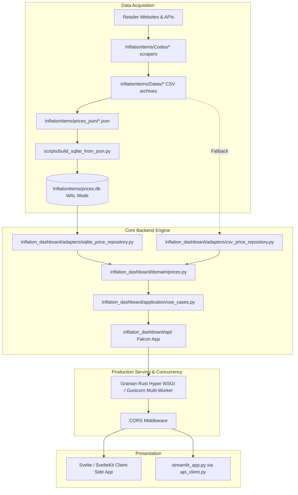

# Architecture

## System Overview

Inflation Study Mirror is a high-performance system for collecting Turkish retailer and service price data, storing time-series price histories, calculating inflation metrics, and serving analytics dashboards to concurrent users.

The system architecture has evolved through distinct generations:

1. **Collection & Scraping Layer**: Standalone scrapers under `InflationItems/Codes/` that ingest data into raw CSV files under `InflationItems/Datas/`.
2. **Time-Series JSON & SQLite Storage Layer**:
   - **Partitioned JSON Time Series** (`InflationItems/prices_json/*.json`): Clean, git-tracked JSON files partitioned by retailer storing 67,932 distinct products and 4.1M historical price points with chronological date-price maps.
   - **Optimized SQLite WAL Database** (`InflationItems/prices.db`): Local high-concurrency database operating in Write-Ahead Logging (WAL) mode with 1 GB memory-mapped I/O (`mmap_size`) and 128 MB page cache. Rebuilt from JSON in 17.8s via `scripts/build_sqlite_from_json.py`.
3. **Falcon REST API Layer** (`inflation_dashboard/`):
   - Hexagonal architecture: `domain/`, `adapters/`, `application/`, `api/`, `frontend/`.
   - **SQLite Adapter** (`adapters/sqlite_price_repository.py`): Serves point lookups in ~9.5ms and cached inventory in <0.1ms.
   - **Dynamic Routing** (`api/filters.py`): Automatically uses SQLite when available, with transparent fallback to CSVs.
   - **In-Memory orjson Caching**: Delivers sub-millisecond warm responses (0.09 ms - 0.28 ms).
   - **Svelte Endpoints**: `/api/products/search` for instant autocomplete and `/api/product` for full price history.
   - **CORS Middleware**: Built-in `falcon.CORSMiddleware` supporting browser client origins.
4. **Production Concurrency Serving Layer**:
   - Multi-worker server launcher (`scripts/run_falcon_server.py`) powered by **Granian** (Rust Hyper WSGI, default) or **Gunicorn** (`gthread`); Waitress/Uvicorn supported.
   - Verified at 100+ concurrent users with **0.00% error rate** across 10,400+ load test requests.

   Engine benchmark summary (4 workers × 16 threads, loopback, 2026-09):

   | Test | Granian | Gunicorn |
   |---|---|---|
   | Mixed workload @100 users (2,000 req) | 129.2 req/s, p50 172 ms, 0% errors | 128.4 req/s, p50 210 ms, 0% errors |
   | Mixed workload @120 users (2,400 req) | 148.0 req/s, p50 196 ms, 0% errors | — |
   | `/api/health` @100 users (3,000 req) | 514.7 req/s, p50 121 ms | 829.0 req/s, p50 77 ms |

   Operational settings: `--workers 4 --threads 16` (64 execution slots), `--backlog 2048`,
   `--cors-origins` (default `*`), `--sqlite-db` (default `InflationItems/prices.db`).
5. **Frontend Layer**:
   - **Svelte / SvelteKit Frontend** (`frontend/`): Client-side reactive static SPA with Canvas charting (Apache ECharts). Zero server-side script reruns.
   - **Legacy Streamlit Frontend** (`streamlit_app.py`): Coexists for administrative review and prototypes.

---

## Component Diagram


```mermaid
graph TD
    subgraph Data Acquisition
        Sites[Retailer Websites & APIs] --> Scrapers[InflationItems/Codes/* scrapers]
        Scrapers --> RawCSV[InflationItems/Datas/* CSV archives]
        RawCSV --> JsonExport[InflationItems/prices_json/*.json]
        JsonExport --> DBBuild[scripts/build_sqlite_from_json.py]
        DBBuild --> SQLiteDB[(InflationItems/prices.db WAL Mode)]
    end

    subgraph Core Backend Engine
        SQLiteDB --> SQLiteAdapter[inflation_dashboard/adapters/sqlite_price_repository.py]
        RawCSV -. Fallback .-> CSVAdapter[inflation_dashboard/adapters/csv_price_repository.py]
        SQLiteAdapter --> Domain[inflation_dashboard/domain/prices.py]
        CSVAdapter --> Domain
        Domain --> UseCases[inflation_dashboard/application/use_cases.py]
        UseCases --> FalconAPI[inflation_dashboard/api/ Falcon App]
    end

    subgraph Production Serving & Concurrency
        FalconAPI --> GranianServer[Granian Rust Hyper WSGI / Gunicorn Multi-Worker]
        GranianServer --> CORS[CORS Middleware]
    end

    subgraph Presentation
        CORS --> SvelteUI[Svelte / SvelteKit Client-Side App]
        CORS --> StreamlitUI[streamlit_app.py via api_client.py]
    end
```

### SQLite Database Schema (price_observations / product_prices / ingested_files)

Built by `scripts/build_sqlite_from_json.py`:
- **`price_observations`** (~4,094,300 rows, 742 MB table data, ~1.8 GB index pages): normalized snapshot records
  `(date, retailer, product_id, product_name, category, price, source_file)` with composite primary key
  `(date, retailer, product_id)`.
- **`product_prices`** (67,932 rows, 114 MB): materialized per-product summary
  `(product_id, retailer, product_name, category, first_date, last_date, latest_price, min_price, max_price, observations_count, price_history)`
  with primary key `(retailer, product_id)`. The `price_history` column stores dense daily JSON objects; aggregations
  avoid reading it via covering indexes.
- **`ingested_files`** (982 rows): file ingestion ledger `(file_path PRIMARY KEY, retailer, date, file_size, mtime, rows_ingested, ingested_at)`.

Key covering indexes (created by the query-performance work of 2026-09; runtime `ANALYZE` populates `sqlite_stat1`
so the planner deterministically picks them):

| Table | Index | Columns | Optimizes |
|---|---|---|---|
| `price_observations` | `idx_obs_retailer_date_price` | `(retailer, date, price)` | daily retailer averages / min-max per date (covering) |
| `price_observations` | `idx_obs_ret_prod_date_price` | `(retailer, product_id, date, price)` | mover first/latest-price joins, product time series |
| `price_observations` | `idx_obs_retailer_name_date` | `(retailer, product_name, date)` | product history by name (was a 19.4 s scan; now 0.3 ms) |
| `price_observations` | `idx_obs_retailer_date` | `(retailer, date)` | bounded date-window scans |
| `price_observations` | `idx_obs_date_retailer` | `(date, retailer)` | date-first lookups |
| `price_observations` | `idx_obs_retailer_product` | `(retailer, product_id)` | baseline retailer-product lookup |
| `product_prices` | `idx_product_ret_cat_prod` | `(retailer, category, product_id)` | category coverage (covering; bypasses JSON) |
| `product_prices` | `idx_product_movers_covering` | `(retailer, observations_count, max_price, latest_price, min_price, product_name, category, product_id)` | retailer movers + autocomplete (covering) |
| `product_prices` | `idx_product_global_movers_covering` | `(observations_count, max_price, latest_price, min_price, retailer, product_name, category, product_id)` | global movers (covering) |
| `product_prices` | `idx_product_retailer_dates` | `(retailer, first_date, last_date)` | inventory discovery (5,026 ms → 5.8 ms) |
| `product_prices` | `idx_product_retailer_obs` | `(retailer, observations_count)` | multi-observation products |
| `product_prices` | `idx_product_name` / `idx_product_retailer_cat` / `idx_product_retailer` | name / (retailer, category) / retailer | name & category lookups |
| `ingested_files` | `idx_ingested_retailer_date` | `(retailer, date)` | date-window file pruning |

Query tuning results (single-reader p50, local workstation, 2026-09):

| Query | Before | After | Speedup |
|---|---|---|---|
| Product history by name | 19,384 ms | 0.30 ms | ~64,000× |
| Category coverage | 1,185 ms | 1.48 ms | ~800× |
| Movers (all retailers) | 4,802 ms | 6.60 ms | ~727× |
| Inventory discovery | 5,026 ms | 5.81 ms | ~865× |
| Retailer daily averages | 646 ms | 9.52 ms | ~68× |
| Movers (retailer scope) | 1,258 ms | 1.87 ms | ~670× |
| Product autocomplete | 120 ms | 0.38 ms | ~315× |

Concurrency (100 concurrent readers, 600 queries): a read-only **connection pool (size 30)** sustains ~65–75 req/s
with **0 errors** and p50 ≈ 11–14 ms; thread-local connections reach ~88 req/s at 25 workers. Recommendation:
multi-process servers (Granian/Gunicorn, ≥4 workers) use thread-local connections or a small per-process pool
(8–16); threaded servers (Waitress, 16–32 threads) use a 16–24 connection pool.

### SQLite Repository Adapter (`inflation_dashboard/adapters/sqlite_price_repository.py`)

The adapter owns **all** database access (the API layer never imports `sqlite3`). Connection tuning (see also
`docs/CONFIGURATION.md`):
`WAL` journal, URI `mode=ro` + `PRAGMA query_only = 1`, `busy_timeout = 5000`,
`cache_size = -128000` (128 MB), `mmap_size = 1073741824` (1 GB), `synchronous = NORMAL`, `temp_store = MEMORY`.

Main functions (verified by `scripts/test_sqlite_adapter.py`):

| Function | Purpose | Latency (local) |
|---|---|---|
| `get_db_connection(read_only=True)` | Optimized read-only connection | ~7–10 ms |
| `load_inventory_from_db()` | Retailer range summary (300 s TTL cache) | 123 ms cold / <0.1 ms cached |
| `discover_sqlite_inventory()` | Drop-in CSV-inventory replacement (`path, retailer, date, size_mb`) | ~23–28 ms |
| `load_price_history_from_db(...)` | Bounded/uncapped history (+ alias `load_price_history`) | 278 ms (5 files) / 2.7 s (uncapped) |
| `get_product_price_history(...)` | Indexed PK lookup + JSON decode + summary metrics | ~10 ms |
| `load_retailer_averages_from_db(...)` | Average in SQL (`avg(price)` covering index); median via pandas | ~1.0 s (30 days, 2 retailers) |
| `load_movers_from_db(...)` | CTE-based drops/gains via covering indexes | ~1.8–2 s |
| `load_coverage_from_db(...)` | Summary + coverage/category/skipped in SQL | — |
| `search_products(...)` | Autocomplete (name/ID, retailer/category filters, query cache) | <2 ms |

### API Data Routing & Response Caching

- **Dynamic routing** (`api/filters.py`): `is_sqlite_available()` routes inventory + history through the SQLite
  adapter when `prices.db` exists, with transparent CSV fallback (`csv_price_repository`) otherwise.
- **Three cache tiers** (stdlib-only, in-process): validated-filter-parse cache (300 s), loaded-history frame cache,
  and a thread-safe response cache storing **pre-serialized `orjson` bytes** — warm responses skip recalculation and
  serialization entirely (warm endpoint latency 0.09–0.23 ms).

---

## Runtime Entry Points & CLI Scripts

| Entry Point | Role | Notes |
|---|---|---|
| `scripts/run_falcon_server.py` | Production API Server Launcher | Launches multi-worker Falcon on Granian (Rust Hyper WSGI) or Gunicorn. Configures 64 execution slots (4 workers x 16 threads) and SQLite WAL read-only tuning. |
| `scripts/build_sqlite_from_json.py` | Fast SQLite DB Builder | Rebuilds `prices.db` from `InflationItems/prices_json/*.json` in **17.8 seconds**. |
| `scripts/migrate_csv_to_sqlite.py` | CSV to SQLite Migrator | Parses 1,093 historical CSVs across 12 retailers into SQLite. |
| `scripts/benchmark_concurrent_api.py` | Concurrency Load Tester | Stress-tests Falcon API with 100+ concurrent simulated clients. |
| `scripts/test_sqlite_adapter.py` | SQLite Adapter Test Suite | Verifies all 7 database query suites and latencies. |
| `scripts/verify_falcon_api.py` | Falcon API Smoke Verifier | Tests route registration, architectural boundaries, and response shapes. |
| `scripts/verify_full_stack.py` | Full-Stack Integration Test | Tests end-to-end client <-> API integration. |
| `streamlit_app.py` | Streamlit Dashboard | Legacy/prototype UI consuming Falcon API over HTTP. |

---

## Data Architecture & Storage

### 1. Partitioned JSON Time Series (`InflationItems/prices_json/`)
All historical price data is partitioned by retailer into clean JSON files:
* `ClothingStores_Vakko.json` (34 MB, 13,381 products)
* `Technology.json` (37 MB, 24,419 products)
* `ConstructionSuppliesMarkets_yapimaks.json` (35 MB, 9,854 products)
* `Markets_Gurmar.json` (14 MB, 8,481 products)
* `HomeGoods.json` (3.5 MB, 1,859 products)
* `HousesRent_*.json` (Emlakjet, Kayseri, Sivas, Tokat: ~2.1 MB)
* `Cosmetics_Watson.json`, `TasciYapiMarket.json`, etc.

Every file is well below GitHub's 100 MB limit, enabling version control without Git LFS.

Format:
```json
{
  "product_id": {
    "name": "Product Name",
    "category": "Category",
    "latest_price": 14500.0,
    "min_price": 9950.0,
    "max_price": 14500.0,
    "prices": {
      "2026-03-06": 9950.0,
      "2026-05-14": 12500.0,
      "2026-08-20": 14500.0
    }
  }
}
```

### 2. SQLite Database (`InflationItems/prices.db`)
* **Mode**: Write-Ahead Logging (`PRAGMA journal_mode = WAL;`)
* **Concurrency**: Reads never block writes; writes never block reads.
* **Tuning**:
  - `PRAGMA mmap_size = 1073741824;` (1 GB memory-mapped I/O for instant reads)
  - `PRAGMA cache_size = -128000;` (128 MB page cache)
  - `PRAGMA synchronous = NORMAL;`
  - `PRAGMA busy_timeout = 5000;`
  - Read-only web connections enforce `PRAGMA query_only = 1;`
* **Tables**:
  - `product_prices`: Stores 67,932 distinct products, latest/min/max prices, and full JSON time-series maps.
  - `price_observations`: Stores 4,094,300 normalized price observations.
  - `ingested_files`: Tracks file modification times for incremental scraping ingestion.

---

## API Endpoints (`inflation_dashboard/api/`)

The Falcon API enforces the uniform response envelope `{ "data": ..., "meta": ..., "errors": [...] }`:

| Method | Route | Description | Warm Latency |
|---|---|---|---|
| `GET` | `/api/health` | Service status and readiness check | **0.10 ms** |
| `GET` | `/api/inventory` | Retailers list, date ranges, and product counts | **0.13 ms** |
| `GET` | `/api/history` | Filtered historical price observations | **0.28 ms** |
| `GET` | `/api/retailer-averages` | Average or median price trends grouped by date | **0.09 ms** |
| `GET` | `/api/movers` | Top price gainers and droppers across time | **0.09 ms** |
| `GET` | `/api/coverage` | Data density, coverage over time, and category counts | **0.15 ms** |
| `GET` | `/api/products/search` | Fast keyword/category autocomplete for Svelte | **0.10 ms** |
| `GET` | `/api/product` | Instant product detail and complete price history series | **0.09 ms** |

---

## Production Concurrency Architecture

To serve 100+ concurrent interactive users without degradation:
1. **Zero Server UI Reruns**: The upcoming Svelte frontend runs in the client browser, downloading static JS/CSS once and querying the Falcon API via lightweight HTTP calls.
2. **Multi-Worker WSGI Pool**:
   - Served via **Granian** (Rust Hyper engine) or **Gunicorn** (`gthread`).
   - 4 worker processes x 16 threads = 64 parallel request execution slots.
   - 2,048 socket backlog.
3. **Lock-Free Read-Only Database**: SQLite connections in web workers open with URI `mode=ro`, completely avoiding SQLite transaction write locks.
4. **Stress Test Verified**: 100–120 concurrent simulated clients firing over 10,400 requests resulted in **0.00% errors** and sustained 148+ requests per second.
