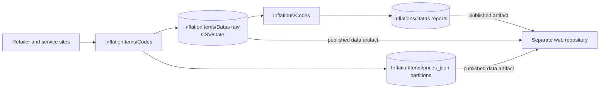

# Architecture

## System boundary

This repository owns data acquisition and inflation computation. The Svelte frontend, Falcon API and SQLite serving database are external to this repository.

```mermaid
flowchart LR
    Sites[Retailer and service sites]
    Scrapers[InflationItems/Codes]
    Raw[(InflationItems/Datas raw CSV/state)]
    JSON[(InflationItems/prices_json partitions)]
    Calculators[Inflations/Codes]
    Outputs[(Inflations/Datas reports)]
    WebRepo[Separate web repository]

    Sites --> Scrapers
    Scrapers --> Raw
    Scrapers --> JSON
    Raw --> Calculators
    Calculators --> Outputs
    Raw -->|published data artifact| WebRepo
    JSON -->|published data artifact| WebRepo
    Outputs -->|published artifact| WebRepo
```

## Collection layer

Source-specific scripts live under `InflationItems/Codes/` and are grouped by market domain and retailer/service. They own:

- HTTP/browser access;
- source-specific selectors and API payloads;
- pagination, rate limits and retries;
- checkpoint/resume state;
- source schema validation;
- dated CSV or canonical dataset output.

The data repository deliberately does not contain a web application or a SQLite serving database.

## Raw data layer

`InflationItems/Datas/` is the auditable raw archive. Source schemas vary by retailer, and many files are intentionally tracked in Git so historical changes remain reviewable.

Operational state such as EpeyKatfg catalogs/series and scraper checkpoints belongs beside the relevant source data. Secrets and browser profiles never belong in Git.

## Partitioned history layer

`InflationItems/prices_json/` contains generated retailer-partitioned price histories used as the preferred hand-off to the web repository. It remains ignored by default because it is derived from raw observations and can be large.

The current JSON representation is a sparse change-event series. Consumers must use the most recent price event on or before a requested day when reconstructing a step-valued daily history.

## Inflation layer

`Inflations/Codes/` owns:

- source/product normalization;
- matched-product comparisons;
- per-product and aggregate inflation metrics;
- TÜİK-style category and weight configuration;
- rent and hunger-threshold calculations;
- generated reports under `Inflations/Datas/`.

Calculator code reads raw source data but does not import the web repository or serve HTTP requests.

## Publication boundary

The separate web repository builds SQLite from published JSON or raw CSV and serves it through Falcon. This repository publishes data artifacts and methodology; it does not own the runtime database.

See `DATA_PUBLICATION.md` for the hand-off contract.

## Design principles

- Keep source-specific behavior inside the relevant scraper.
- Prefer deterministic extraction and explicit schema checks.
- Use bounded live runs to verify scraper behavior.
- Preserve raw observations before derived calculations.
- Keep generated datasets reproducible from source data.
- Keep web/framework concerns out of this repository.
